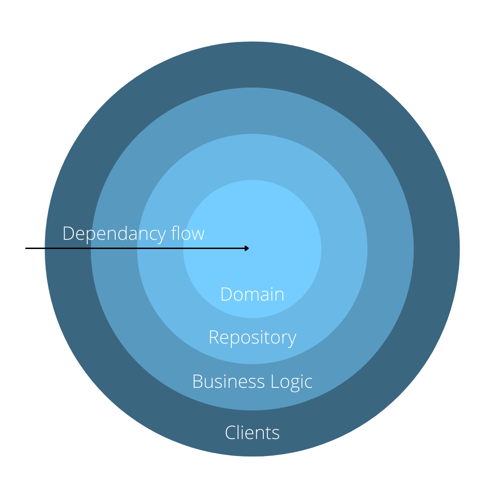

# Onion Architecture #

The onion architecture (or clean architecture) is a architectural pattern that separates parts of an application into different layers. The fundamental rule of onion architecture is that all code can depend on inner layers but not outer layers. One of the key tenet The dependencies always point inwards, a layer can use any of the layers inside of it. The layers are as follows:

**Domain**

This is the centre of the onion and contains the data entities. The data entities define the objects that make up the application. For example, an online store would contain objects such as product, order, and customer.

**Repository**

This layer is responsible for interactions with the database.

**Business Logic**

This layer stores the business logic and facilitates communication between the Clients and the Repository layers.

**Clients**

This is the outermost layer and is responsible for providing the user-facing part of the application, e.g. a web application, web API, or unit tests.

## Pros ##

* Internal layers are not dependant on external layers.
* Adding a new way to interact with the application is relatively easy.

## Cons ##

* Changes made to the inner layers could affect behaviour in the outer layers.